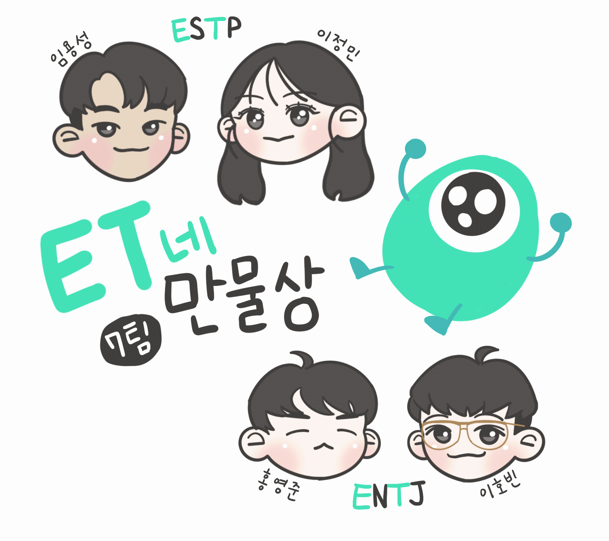

<h1 align='center'>ET들</h1>
<h2 align='center'>ESTP 이정민 임용성 / 이호빈 홍영준 ENTJ</h2>
<h2 align='center'>https://store-7.woowahan-techcamp.shop/welcome</h2>

## Tect Stack

### Front

### Back

## Contributors

### ET의 얼굴(?) [이정민](https://github.com/danmin20) - ESTP
즐겁고 후회없는 삶을 살기위해 오늘도 고군분투하는 중입니다!

### ET의 두 다리 [임용성](https://github.com/LeagueLugas) - ESTP
코딩하며 일하고, 코딩하며 쉬고, 코딩하며 놀고 싶은 마음으로 코딩을 즐기고 있습니다~

### ET의 오른팔 [이호빈](https://github.com/HobinLee) - ENTJ
사용자와 팀원들에게 기분 좋은 경험을 선사하기 위해 오늘도 열심히 삽질을 하는 중입니다.

### ET의 왼팔 [홍영준](https://github.com/jjunyjjuny) - ENTJ
하루종일 앉아서 개발하다보니 정말 ET가 될 것 같습니다..  
~~근데 우리 ET는 오른손잡이에요.. 열심히해서 양손잡이 ET가 되도록 팀에 기여하겠습니다~~

  
  

