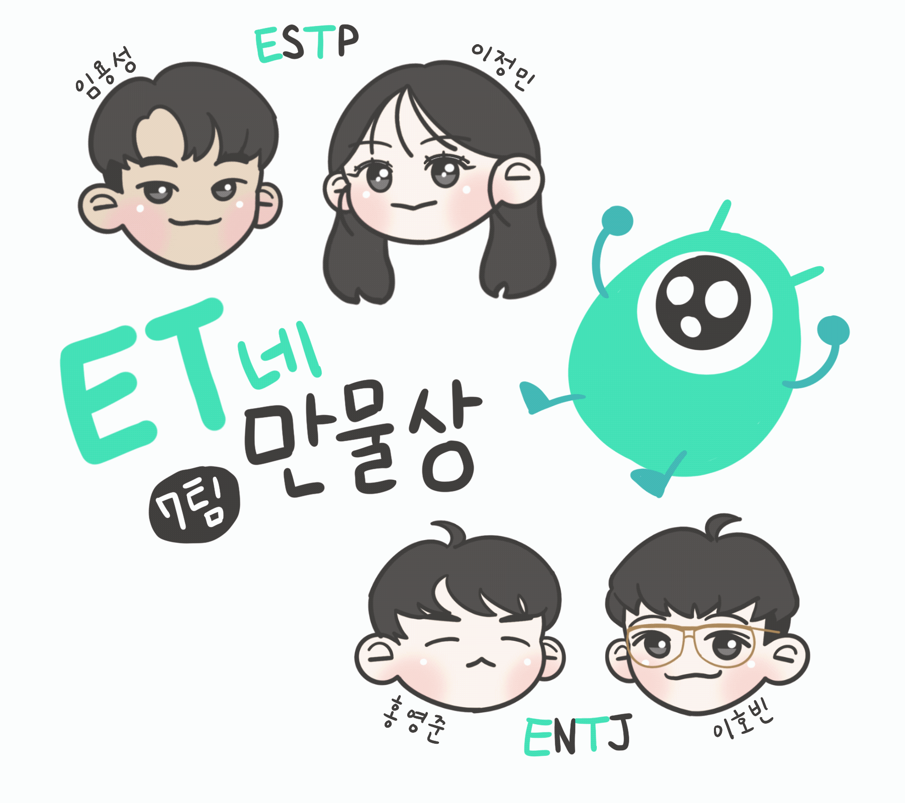

<h1 align='center'>ET들</h1>

<h4 align='center'>Website https://store.leehov.in/welcome</h4>
<h4 align='center'>Youtube https://www.youtube.com/watch?v=3ZnELv6jqxk</h4>
<h4 align='center'>PPT https://drive.google.com/file/d/11wWUoLeXw68vZTG88NxNVSDj5g6X7m2J/view?usp=sharing</h4>

<div align='center'>
  
</div>

## `Tech Stack`

### Front

[]()
[]()
[]()
[]()
[]()
[]()
[]()

### Back

[]()
[]()
[]()
[]()

<br/>

## `Infra Architecture`


<br/>

## `Install & Execute`

### client/env/.env

- dev용은 client/env/dev.env

```
BASE_URL = api endpoint
IMG_URL = image api endpoint
DEMO_EMAIL = test@test.test
DEMO_PW = test@test.test
```

### server/.env

```
MYSQL_HOST = db host
MYSQL_PASSWORD = db pw
MYSQL_DATABASE = db name
SERVER_PORT = server psort
MYSQL_PORT = db port
MYSQL_USERNAME = db username

ELASTIC_NODE = elastic endpoint
ELASTIC_USERNAME = elastic username
ELASTIC_PASSWORD = elastic pw

S3_ACCESS_KEY = s3 access key
S3_SECRET_KEY = s3 secret key
S3_REGION = s3 region
S3_BUCKET = s3 bucket

KAKAO_KEY = kakaypay api key
JWT_SECRET = jwt secret

GITHUB_REDIRECT_URI = github oauth redirect uri
GITHUB_CLIENT_SECRET = github oauth client secret
GITHUB_CLIENT_ID = github oauth client id

GOOGLE_REDIRECT_URI = google oauth redirect uri
GOOGLE_CLIENT_SECRET = google oauth client secret
GOOGLE_CLIENT_ID = google oauth client id

CLIENT = client dev origin
```

<br/>

## `DEV mode Scripts`

### server

`npm i` 이후 `npm run start:dev`

### client

`yarn` 이후 `yarn dev`

<br/>

## `Structure`

```
client
├── __mocks__                       # jest mock
├── config                          # webpack config
└── src
    ├── api                         # api 관련 함수 및 훅
    ├── assets                      # resoucres
    │   └── Components
    │       └── ${name}
    │            ├── index.tsx
    │            └── name.test.tsx  # test code
    │
    └── config
    │   └── properties.ts           # docker용 환경변수
    ├── hooks                       # custom hooks
    ├── Pages                       # 페이지
    │   └── ${name}
    │        ├── index.tsx
    │        ├── name.test.tsx
    │        └── ${name}            # 하위 컴포넌트
    │             ├── index.tsx
    │             └── name.test.tsx
    ├── shared                      # 공용 dummy, styled, type
    ├── store                       # recoil atom
    ├── styles                      # globall-style, theme
    └── utils                       # 유틸 함수들

server
├── src
│   └── ${domain}
│       ├── application             # service
│       ├── domain
│       ├── dto
│       ├── entity
│       ├── infrastructure          # 인증, 사진 업로드
│       └── presentation            # congtroller
└── test                            # test code
```

## Contributors

### ET의 얼굴(?) [이정민](https://github.com/danmin20) - ESTP

즐겁고 후회없는 삶을 살기위해 오늘도 고군분투하는 중입니다!

### ET의 두 다리 [임용성](https://github.com/LeagueLugas) - ESTP

코딩하며 일하고, 코딩하며 쉬고, 코딩하며 놀고 싶은 마음으로 코딩을 즐기고 있습니다~

### ET의 오른팔 [이호빈](https://github.com/HobinLee) - ENTJ

사용자와 팀원들에게 기분 좋은 경험을 선사하기 위해 오늘도 열심히 삽질을 하는 중입니다.

### ET의 왼팔 [홍영준](https://github.com/jjunyjjuny) - ENTJ

하루종일 앉아서 개발하다보니 정말 ET가 될 것 같습니다..  
~~근데 우리 ET는 오른손잡이에요.. 열심히해서 양손잡이 ET가 되도록 팀에 기여하겠습니다~~

<div>
  
  
</div>


